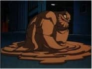
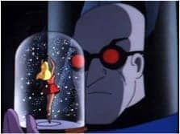
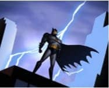

In terms of art, comic books and animated television shows are often belittled or not considered as forms of "high art." High art, or high culture, is defined as a piece that permeates throughout time and sets new standards for that field. It is something that comments on the human condition and yet is aesthetically pleasing. Both graphic novels and cartoons have a rightful place in the eyes of high art, and that fact could not be more evident than in the classic fusion of the two mediums in Batman: The Animated Series (TAS).

Given the time that it was created in 1992, Batman: The Animated Series had superb animation and art design. Character models were based off of Bruce Timm's designs, which modernized Batman characters' appearances without making them dated by today's standards. The movements of the various characters were slow, yet detailed. A single frame is a work of art. Unlike the over-exaggerated actions of cartoons from that time, the movements of each character are realistic. For example, during the two-part episode "Feat of Clay," Batman faces the super villain Clayface (depicted above). This particular episode was animated excellently, because it demonstrated Clayface's moldable, liquid-like abilities through smooth animation.

Fight scenes in the original animated series were not as quickly paced as those found in future cartoons like Justice League Unlimited, however this is not a detriment to the show. Every impact was felt and the occasions where quicker animation were used would be exciting. In "The Demon's Quest," the sword fight between Ra's Al Ghul and Batman was faster, making it tense and full of energy.

The show also employed use of shadows and minimalist art for the title cards and the actual show, which is appropriate for the tone of Batman: The Animated Series. The use of shadows made it easier to animate, thus adding fluidity to the movements. Through silhouettes, a feeling of power and mystery was made whenever a character (usually Batman as shown on the right) is shown in darkness with only a few features showing. In the episode "The Laughing Fish," as The Joker staggers away Batman appears in shadow looming over Joker. It was an extremely intimidating frame; this noir motif matched the show's darker tone compared to the light-hearted comedic shows that shared its channel like Tiny Toons and Animaniacs.

One of the greatest praises Batman: The Animated Series  received was due to its superior voice acting. Kevin Conroy is the definitive Batman, using two different voices to portray  Batman and Bruce Wayne - the former is deep and subdued, while the latter is higher pitched and emotive. His performance was so well received that Conroy continues to be The Dark Knight's voice to this day. Conroy's costar Mark Hamill voiced the Joker and brought a manic energy to the role. He perfectly balanced playfulness and psychopathic sadism in his voice. Unsurprisingly, Hamill was nominated in 1994 for Best Achievement for Voice Acting for his role as The Joker.

Through the sheer power of their voices, Conroy and Hamill brought life to these characters and remain inseparable from them.

Aspects from the show actually influenced the comic and animated world. Everyone's favorite killer jester, Harley Quinn (on left), made her debut in Batman: The Animated Series. Her main purpose was to be just another henchman for the Joker, but due to her popularity she was introduced into the comic's universe. Police detective Renee Montoya had a similar situation, but the only difference was that she was introduced into comics right before the show's airing. As an older villain, Mr. Freeze's origin was revamped in order to match with the serious nature of the show. This change stuck for the mainstream comics due to it being high quality. The aforementioned Clayface was also visually updated in the comics to be more akin to his animated counterpart. All of these new characters and changes are still in existence in movies, comics, and more cartoons. Because this show had brought characters like Mr. Freeze and Harley Quinn into the limelight, they will always permeate through time.

Batman: The Animated Series was the gateway for more DC comics animated shows. After the success of Batman's show, the creators started Superman: The Animated Series, which took place in the same universe. Following that was the Justice League and Justice League Unlimited cartoons.  From 1992 to 2006 cartoons based on DC comics within a cohesive continuity and serious stories had been popular thanks to Batman. In other words, this show was the standard for animation and graphic novels and a foundation upon which future animated comic book shows were built for fourteen years.

The characters were the show's greatest strength. While there wasn't an overarching story, most of the episodes dealt with some kind of social issue. Mental health issues were a common theme, each of Batman's villains represented a different type: Poison Ivy symbolized the evils of fanatical activism and eco terrorism, Two-Face or Harvey Dent was a metaphor for split personality disorder, and the Joker was the personification of chaos ("Arkham Sessions").
The show created three-dimensional characters that many sympathize with. The aforementioned Mr. Freeze (shown on right) received a new origin story. Originally, Mr. Freeze was the typical mad scientist and not treated seriously. That changed, however, when Paul Dini wrote the episode "Heart of Ice." The backstory for Mr. Freeze became that Doctor Victor Fries (of course pronounced "freeze") tried to save his wife Nora through cryogenic suspension, but his funding got shut down due to the CEO's greed which potentially could kill her. In a fit of rage, Fries pulled a gun on the CEO and he got kicked into a table full of chemicals, turning him into a vengeful man who cannot survive outside subzero temperatures. It was a tortured existence as he explained in the episode, "To never again walk on a summer's day with the hot wind in your face and a warm hand to hold. Oh yes, I'd kill for that!" The accident made him cold and emotionless as shown when he allowed one of his henchmen to be frozen and left behind because of his "incompetence." Half of his lines are comprised of wanting for revenge and spoken in robotic monotone. On numerous occasions he claims he is emotionless, yet after he fails to exact his vengeance he cries and asks his wife for forgiveness. Sadness is an emotion.

Instead of being just a man with a cool gun (pun intended), Mr. Freeze became a tragic character who had a dying wife and was constrained in a refrigerated suit. It was groundbreaking. Of course the most complex character in the entire show is the Caped Crusader himself (shown left). Bruce Wayne had witnessed the death of his own parents at the age of eight and ever since that night he had dedicated his life to fighting evil. In addition to training to be an expert detective and fighter, Bruce Wayne is the head of a major company that regularly donates to charity. Batman adopted Dick Grayson, Robin, after Dick's parents are murdered much like his own parents. Every night he faces criminals and supervillains, yet he manages to maintain appearances for social events. Batman did all of this in the name of his dead parents, and that requires superhuman time management skills. The (relative) realism found within all of these characters give the viewer empathy toward the actions these people may commit, and it is up to the watcher to justify their actions if possible.

Often times in Batman: The Animated Series, there wasn't an easy answer to the questions raised which revealed a truth: life isn't black or white but actually a series of circumstances that create the hands of fate. In the episode "Two-Face," Batman defeats Harvey Dent (shown right) by throwing a box of silver dollars on the ground as Dent flips his own coin that determined if his hostage would die, making him mentally break down when he can't find his among the other coins. It was established early in the episode that Harvey Dent had anger issues that manifested into an alternate personality at a young age, so the question of Dent being conscious of his actions was raised. It was unclear if Dent was a bad guy. There was no revelry on Batman's side despite his victory. In fact, there was quite a bit of crying. It all ended on a sad note, making it more nuanced than that of the typical superhero cartoon.

Although there are many points that support Batman: The Animated Series as a piece of high art, there is an argument to be made that it is actually low art (shown left) (Plescher). "Low art" is often categorized as mass produced and for a wide audience. Popular culture is often seen as the same as low culture and the show is part of pop culture ("High and Low"). Using the transitive relation, that makes Batman low art. Granted, anything that has action figures made for it is difficult to be deemed as "not intended for a wide audience," ( and I am positive that I have some Batman action figures in my basement). There is truth to that, in the fact that the wide audience intention and subsequent commercialization aspect does deafen its ability to be defined as true high art. However, it is because the aspects that made it a candidate for high art overshadow the low art characteristics, thus making it push through the boundaries between the two.

By utilizing fantastic animation and art design, this show is a visual work of art. The animated series fleshed out realistic characters, (as realistic as a living lump of clay can be,) that challenge the ideas of evil. It also broke new ground in animation and in comics by introducing new characters and concepts to the tedium. Batman: The Animated Series has paved the way for further appreciation of graphic novels and animated television shows.

### Works Cited
Burnett, Alan. "Two-Face." Batman: The Animated Series. 25 Sept. 1992. Television.

Dini, Paul. "Heart of Ice." Batman: The Animated Series. 7 Sept. 1992. Television.

Dini, Paul. "The Laughing Fish." Batman: The Animated Series. 10 Jan. 1993. Television. "High and Low Culture - Boundless Open Textbook." Boundless. N.p., n.d. Web. 08 Dec. 2016.

O'Neil, Dennis. "The Demon's Quest." Batman: The Animated Series. 3 May 1993. Television. Plescher,

Matt. "High and Low Art | The Rapidian." The Rapidian | Therapidian.org. N.p., n.d. Web. 09 Dec. 2016.

"The Arkham Sessions Delve Deeper Into the Animated Batman." Psychology Today. N.p., n.d. Web. 08 Dec. 2016.

Wolfman, Marv. "Feat of Clay." Batman: The Animated Series. 8 Sept. 1992. Television.
